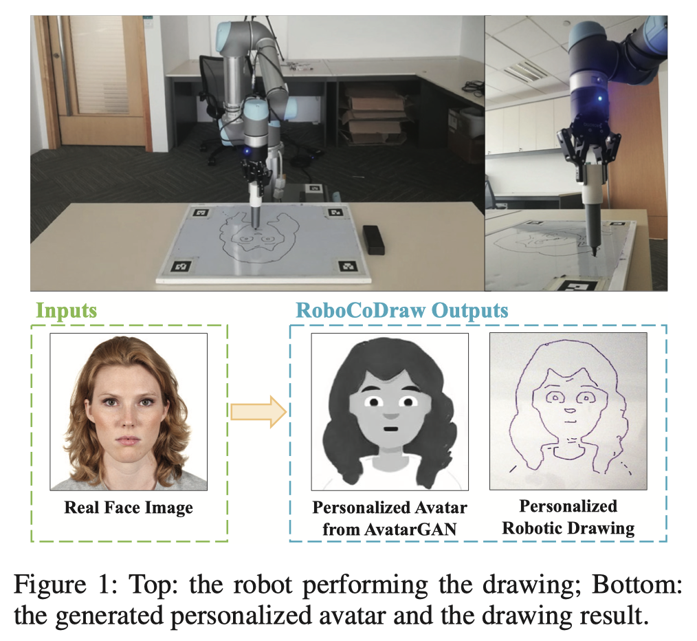
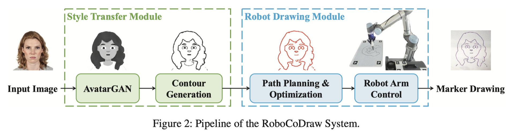

# Reference - Avatar-GAN (RoboCoDraw)

This is a summary of the paper "RoboCoDraw: Robotic Avatar Drawing with GAN-Based Style Transfer and Time-Efficient Path Optimization" {cite}`wang2020robocodraw`

## Abstract

Robotic drawing is a process in which a robot is used to create drawings. The RoboCoDraw system, which was developed using a combination of Generative Adversarial Networks (GANs) and Random-Key Genetic Algorithms (RKGAs), is capable of creating stylized sketches of human faces in real-time. The system converts a real human face image into a stylized avatar image using the AvatarGAN, which is a type of GAN trained with unpaired face and avatar images. The avatar image is then converted into sketches and the RKGA is used to find an efficient path for the robot to follow when drawing the image. The RoboCoDraw system has been demonstrated using a collaborative robot called the UR5.

## Introduction

## Related Work

### Style Transfer

### Path Planning for Robotic Drawing

The path planning module is to reduce the time required for 

## The RoboCoDraw System

### Style Transfer Module

The style transfer module consists of two components. One is AvatarGAN, which performs photo-to-avatar translation; the other is Contour Generation for extracting coherent contours from generated avatars.

#### AvatarGAN

#### Contour Generation

### Robotic Drawing Module

The robotic drawing module plans an optimized path for the robotic arm to draw the avatars generated from the style transfer module. It first extracts the pixel-coordinates required for the robot drawing path, then optimizes the path by formulating the robotic drawing problem as a Generalized Travelling Salesman Problem (GTSP).

#### Ordered Pixel-Coordinates Extraction

#### Robotic Drawing Path Optimization

#### Encoding and decoding with random keys

#### Fitness evaluation

#### Genetic operators

#### Local improvement heuristics

## Experiments and Discussion

## Conclusion

