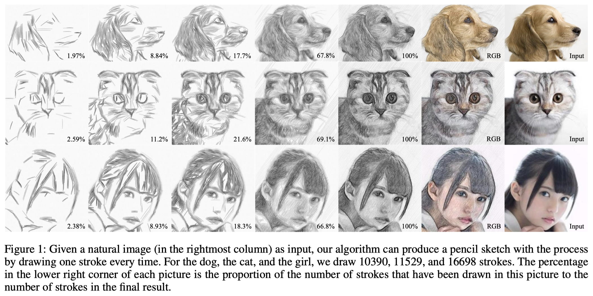
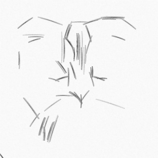
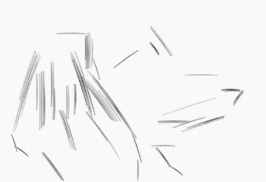
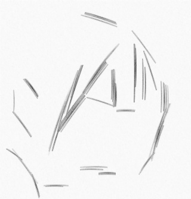
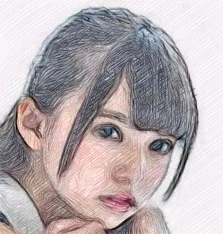

# Reference - Sketch Generation with Drawing Process Guided by Vector Flow and Grayscale

## Results

::::{grid} 2

:::{grid-item}
Image Evolution
:::
:::{grid-item}
Final generated image (RGB)
:::
:::{grid-item}

:::
:::{grid-item}

:::
:::{grid-item}

:::
:::{grid-item}

:::
:::{grid-item}

:::
:::{grid-item}

:::
::::

## Reference

- [Sketch Generation with Drawing Process Guided by Vector Flow and Grayscale](https://github.com/TZYSJTU/Sketch-Generation-with-Drawing-Process-Guided-by-Vector-Flow-and-Grayscale)
  