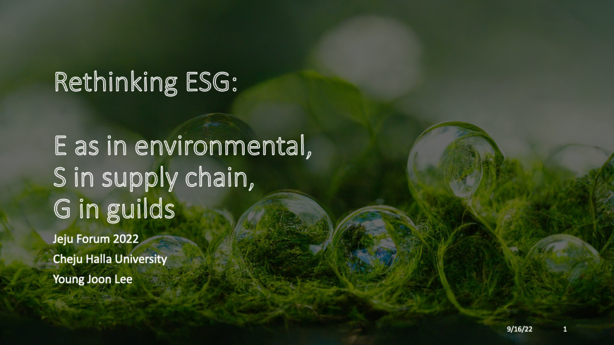

# Rethinking ESG

## E in environmental, S in supply chains, and G in guilds

One of the hottest areas of investing in recent years has been ESG: the use of environmental, social, and governance criteria to evaluate possible investments. However, the concept that you can make money while doing good has increasingly come under fire. By prioritizing environmental, social, and governance (ESG) factors, investors want to improve the efficiency of the capital system and mitigate the catastrophic effects of climate change. More than $35 trillion, or one-third, of the assets managed by major investment firms, are reportedly analyzed using an ESG framework. It's natural to anticipate tremendous things to result from this. That is not the case at all. Unfortunately, those three letters have become a buzzword for hype and controversy. Conservatives blame a "climate cartel" for skyrocketing gas prices. Industry insiders have been accused of "greenwashing" or deliberately misleading consumers. Government agencies are scrutinizing companies ranging from Goldman Sachs to Deutsche Bank. There are three fundamental issues with ESG that make it problematic. First, because it combines a bewildering diversity of aims, it does not provide a cohesive direction for investors and businesses to make the unavoidable trade-offs that must be made in every society. Secondly, it presents an inaccurate picture of the rewards. Finally, there is an issue with how ESG is measured. There are significant discrepancies across the various scoring methods, which may be gamed. The correlation between credit ratings from different agencies is 99 percent. However, ESG scores only add up around half the time.

The ESG framework should be reconsidered. By separating E, S, and G, we can focus on emissions, the first of these three acronyms. Emissions are the leading cause of global warming, which is why ESG investing has gained so much attention. Next, consider your supply chains. Most of the company's environmental impact is felt through its supply chains. In terms of G, we can think of a self-governing cooperation body, such as guilds. A guild is a collection of people with similar talents and knowledge who watch out for each other's financial well-being. Guilds played an essential role in regulating them by establishing quality standards and ensuring that only trained experts were permitted to work in their industries during the Middle Ages. Guilds can now provide a similar function by compelling firms to decarbonize their value chains.

Cutting carbon emissions from the supply chains often accounts for 60–80 percent of overall emissions. Traceability and transparency are essential for managing Scope 3 emissions. Scope 3 emissions can be challenging to manage and report since they are frequently indirect, remote in the supply chain, and generally outside a company's direct control. Transparency and trust are essential in this game. One company's efforts to reduce its Scope 3 emissions can knock on the emissions inventories of other companies. The game is about lowering emissions, not about who can get away with what. The most effective strategy to combat carbonwashing is to guarantee that any environmental claims are validated and supported by evidence. A blockchain can help with this by providing a secure, transparent, and tamper-proof method of storing and sharing data. It enables businesses to give more accurate, trustworthy, consistent, and easily accessible data on carbon emissions.

Businesses and governments need to work together to encourage and enforce measures to reduce emissions from supplier networks, most of which are run by SMEs. Top-tier corporations have the financial resources to seed, scale, and maintain the greening of the supply chain. When companies act together, they can reduce emissions more quickly and cheaply than they could on their own. Many businesses are already cooperating on projects like the Business Renewables Center (BRC), which assists corporate purchasers in hastening the switch to renewable energy. To convert to renewable energy entirely, as advocated by RE100, a movement with which many major tech companies are affiliated, it is necessary to have rules in place that facilitate the purchase of renewable energy by enterprises.

According to the Asia Pacific Energy Transition Readiness Index, the Asia-Pacific region accounts for roughly half of global carbon emissions in 2020. According to the survey, there was a significant gap between what people believed and what was true about carbon emissions. Participants believe carbon emissions will be 39% lower by 2030 than in 2005. Given that emissions increased by roughly 50% between 2005 and 2020, this is an extremely optimistic and unlikely prediction. Carbon removal is going well in several places. However, strong economic growth has increased the demand for energy, offsetting this progress and causing a net increase in emissions overall. According to the findings of this survey, five areas need to be improved for the energy transition to move forward: funding, know-how, technology, policy, and the supply chain.

To sum up, financial institutions should provide financing and a clearing house to settle transactions in a transparent and low-cost manner. Furthermore, technology providers should create more user-friendly applications that allow for progress tracking and efficient information sharing among various stakeholders. Policymakers must create an enabling environment that provides the right incentives for companies to invest in low-carbon technologies. Large, top-tier corporations should lead their supply chains by providing resources, solutions, and education. Last but not least, cooperation among Northeast Asian countries is critical for encouraging private-sector participation and sharing best practices. In a time of conflict, the business community should be a unifying force that brings people and countries together while also finding a way to green the supply chain.

## Presentations

---

---

---

---

---

---

---

---

---

---

---

---

---

---

---

---

---

---

---

---

---

---

---

---

---

---

